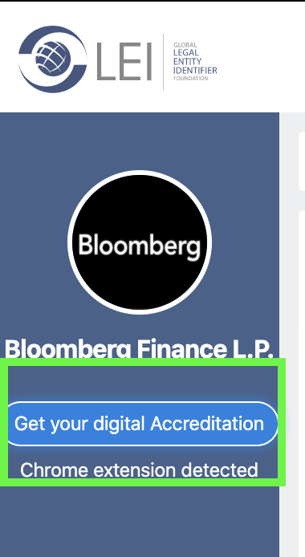
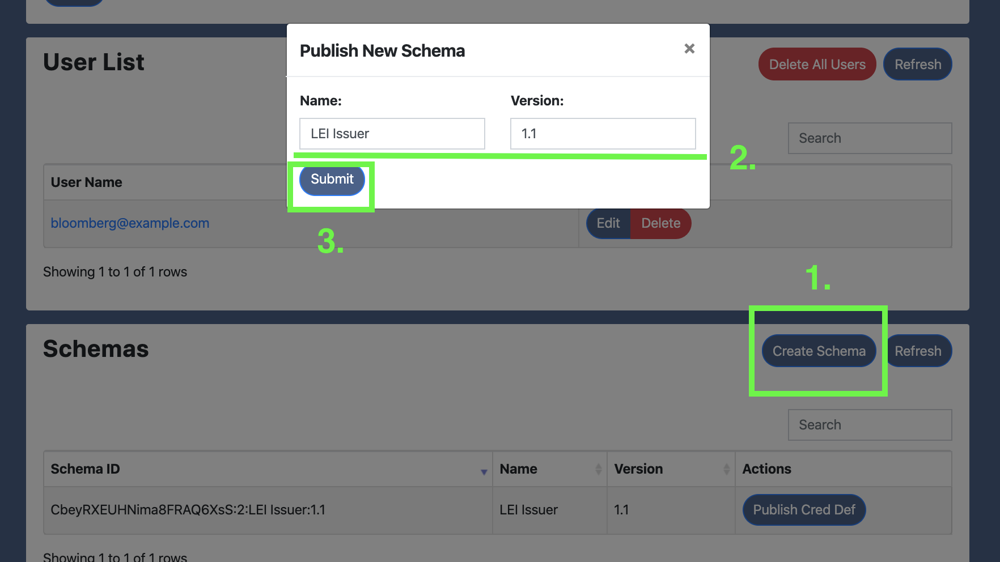

# GLEIF

This project contains the code necessary to run a mockup GLEIF portal that represents a credential issuing service hosted by the Global Legal Entity Identifier Foundation.

The mock application is a Node.js [express](https://expressjs.com/) web app that serves up APIs and web pages related to signing up for a certificate of employment.

## Part 2: Issuing digital accreditation

[Click here](../README.md#passwordless-authentication-demo) to start the demo over.

### Creating a GLEIF user account

Now, you're going to pretend you represent Bloomberg, a Legal Entity Identifier (LEI) issuing institution that is in the process of being accredited by GLEIF to issue LEIs to global entities.  As part of the onboarding process you're going to fill out your information in the GLEIF account database.

1. Click on the `create an account` link in the middle of the login page.
2. Select Bloomberg as the Legal Name.  This will pre-populate the fields in the account portal after you login.
3. Enter the Agent URL for the Bloomberg agent that you have set up. This endpoint will be used by GLEIF to connect to Bloombergs's agent and issue their digital accreditation.
4. Enter the remaining required information such as email address (which will be used as the username of the account) and a password.  All values can be fictitious.  Your password will be used in subsequent instructions.
4. Review the information in the user creation form and click the `Create Account` button on the bottom of the form.
  

### Issuing the digital accreditation

Now you're going to sign in to the GLEIF portal and request that your digital accreditation credential be delivered to your agent.

1. Click on the `GLEIF` logo at the top of the page to return to the user's login page.
  
2. Enter the username and password for the Bloomberg account that you just created and "sign in" to that accountto open their profile page.
  
3. On the profile page, click the `Get your digital Accreditation` button on the left panel of the page.
  
4. Accept the connection offer from `GLEIF` on your mobile app.
5. Accept the credential offer from `GLEIF` on your mobile app.

### Moving on...

You've completed the first step of the demo.  Next up is [signing up for a digital LEI...](../lei-issuer/README.md#signing-up-for-a-digital-LEI)

## Development

#### Publish a schema and a credential definition

> This only needs to be performed once. After the schema and credential definition are published, you can restart the
app without losing them.

1. From the admin page, click the `Create Schema` to open the schema creation modal.
2. (Optional) Fill out the name and version of the schema.  The default values should be fine unless you're experimenting.
3. Click the `Submit` button.  The new schema should appear in the schema list momentarily.
  
4. Click the `Publish Cred Def` button on the entry in the Schemas table. The new credential definition should appear in
the Credential Definitions table momentarily.
  

Now you can create a demo user and issue a credential.
